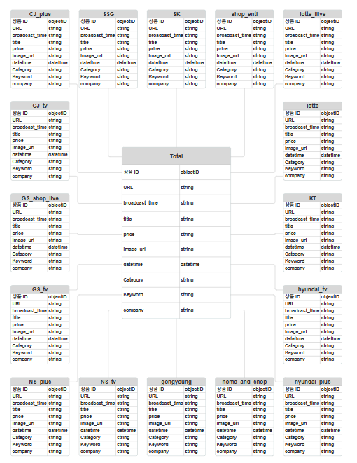

# 📺 Home Shopping & T-commerce Data Crawling Project

## 📚 프로젝트 개요  
이 프로젝트는 국내 **TV 홈쇼핑 및 T커머스** 사이트에서 방송 데이터를 크롤링하고, 방송 제목을 분석하여 **카테고리 분류**와 **핵심 키워드 3개 추출**을 자동화한 작업입니다.

---

## 🔍 프로젝트 주요 기능  
1. **크롤링**  
   - TV 홈쇼핑 및 T커머스의 여러 사이트에서 방송 상품 데이터를 크롤링하여 필요한 정보를 수집합니다.  
   - 방송 시간, 제목, 방송사, 상품 가격 등 주요 데이터를 수집합니다.

2. **카테고리 및 키워드 추출**  
   - 크롤링한 데이터의 **OPENAI API와 방송 제목(title)**을 이용해 카테고리와 3개의 중요 키워드를 추출합니다.  
   - 카테고리 분류 기준은 **네이버 데이터랩의 10개 주요 카테고리**를 활용했습니다.

3. **데이터베이스 설계 및 저장**  
   - 크롤링 및 분석된 데이터는 **MongoDB**에 저장되며, 데이터 구조는 아래의 ERD 이미지로 확인할 수 있습니다.

---

## 🛠️ 데이터 수집 및 처리 로직  
1. **크롤링**  
   - TV 홈쇼핑 및 T커머스 사이트의 방송 데이터를 크롤링합니다.

2. **카테고리 및 키워드 추출**  
   - 각 방송 제목에서 **네이버 데이터랩 카테고리**와 관련된 가장 적합한 카테고리를 매칭합니다.  
   - OpenAI API를 통해 주요 **키워드 3개**를 추출합니다.

3. **데이터 저장**  
   - 수집 및 처리된 데이터는 데이터베이스에 저장합니다.

---

## 📂 데이터베이스 구조 (ERD)  
  
위 이미지는 크롤링 데이터가 데이터베이스에 저장되는 구조를 나타냅니다.

---

## 💡 카테고리 분류 기준  
 - 네이버 데이터랩의 10개 대표 카테고리를 기준으로 방송 제목을 분류했습니다.
 - 네이버 데이터랩의 트렌드 지표를 활용하여 최신 트렌드에 맞는 카테고리 분류와 데이터 분석을 진행했었습니다.

---

## 🛠️ 사용 기술  
- **크롤링**: Selenium, BeautifulSoup  
- **키워드 추출**: OpenAI API  
- **데이터베이스**: MongoDB  
- **버전 관리**: Git  

---